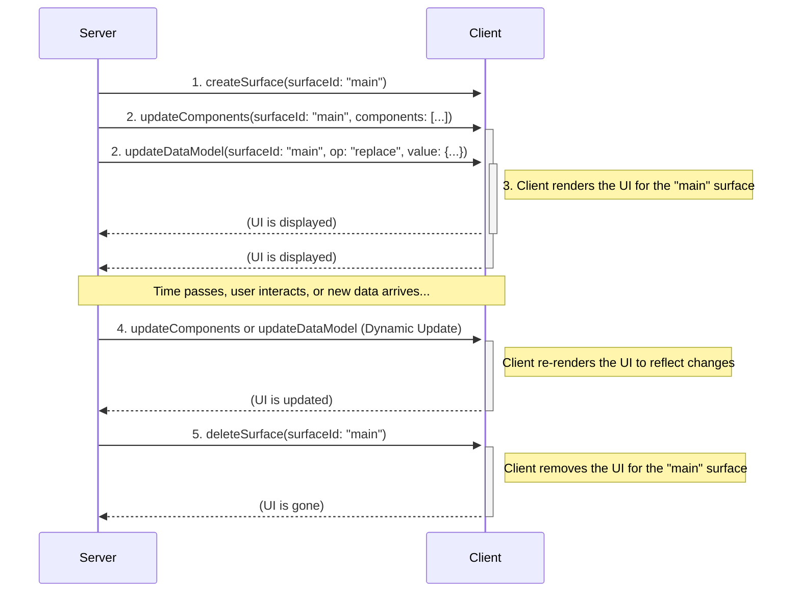
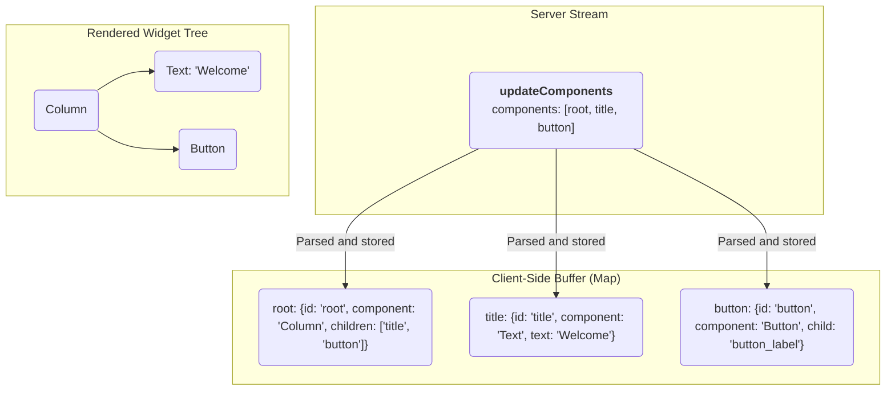

<!-- markdownlint-disable MD041 -->
<!-- markdownlint-disable MD033 -->
<div style="text-align: center;">
  <div class="centered-logo-text-group">
    
    <h1>A2UI (Agent to UI) Protocol v0.9</h1>
  </div>
</div>

A Specification for a JSON-Based, Streaming UI Protocol.

**Version:** 0.9
**Status:** Draft
**Created:** Nov 20, 2025
**Last Updated:** Dec 3, 2025

A Specification for a JSON-Based, Streaming UI Protocol

## Introduction

The A2UI Protocol is designed for dynamically rendering user interfaces from a stream of JSON objects sent from an A2A server. Its core philosophy emphasizes a clean separation of UI structure and application data, enabling progressive rendering as the client processes each message.

Communication occurs via a stream of JSON objects. The client parses each object as a distinct message and incrementally builds or updates the UI. The server-to-client protocol defines four message types:

- `createSurface`: Signals the client to create a new surface and begin rendering it.
- `updateComponents`: Provides a list of component definitions to be added to or updated in a specific surface.
- `updateDataModel`: Provides new data to be inserted into or to replace a surface's data model.
- `deleteSurface`: Explicitly removes a surface and its contents from the UI.

## Changes from previous versions

Version 0.9 of the A2UI protocol represents a philosophical shift from previous versions. While v0.8 was optimized for LLMs that support structured output, v0.9 is designed to be embedded directly within a model's prompt. The LLM is then asked to produce JSON that matches the provided examples and schema descriptions.

This "prompt-first" approach offers several advantages:

1.  **Richer Schema:** The protocol is no longer limited by the constraints of structured output formats. This allows for more readable, complex, and expressive component catalogs.
2.  **Modularity:** The schema is now refactored into separate, more manageable components (e.g., [`common_types.json`], [`standard_catalog_definition.json`], [`server_to_client.json`]), improving maintainability and modularity.

The main disadvantage of this approach is that it requires more complex post-generation validation, as the LLM is not strictly constrained by the schema. This requires robust error handling and correction, so the system can identify discrepancies and attempt to fix them before rendering, or request a retry or correction from the LLM.

## Protocol Overview & Data Flow

The A2UI protocol uses a unidirectional stream of JSON messages from the server to the client to describe and update the UI. The client consumes this stream, builds the UI, and renders it. User interactions are handled separately, typically by sending events to a different endpoint, which may in turn trigger new messages on the UI stream.

Here is an example sequence of events (which don't have to be in exactly this order):

1.  **Create Surface:** The server sends a `createSurface` message to initialize the surface.
2.  **Update Surface:** The server sends one or more `updateComponents` messages containing the definitions for all the components that will be part of the surface.
3.  **Update Data Model:** The server can send `updateDataModel` messages at any time to populate or change the data that the UI components will display.
4.  **Render:** The client renders the UI for the surface, using the component definitions to build the structure and the data model to populate the content.
5.  **Dynamic Updates:** As the user interacts with the application or as new information becomes available, the server can send additional `updateComponents` and `updateDataModel` messages to dynamically change the UI.
6.  **Delete Surface:** When a UI region is no longer needed, the server sends a `deleteSurface` message to remove it.



## The Protocol Schemas

A2UI v0.9 is defined by three interacting JSON schemas.

### Common Types

The [`common_types.json`] schema defines reusable primitives used throughout the protocol.

- **`DynamicString` / `DynamicNumber` / `DynamicBoolean` / `DynamicStringList`**: The core of the data binding system. Any property that can be bound to data is defined as a `Dynamic*` type. It accepts either a literal value, a `path` string ([JSON Pointer]), or a `FunctionCall` (function call).
- **`ChildList`**: Defines how containers hold children. It supports:

  - `array`: A static array of string component IDs.
  - `object`: A template for generating children from a data binding list (requires a template `componentId` and a data binding `path`).

- **`id`**: The unique identifier for a component. Defined here so that all IDs are consistent and can be used for data binding.
- **`weight`**: The relative weight of a component within a Row or Column. This corresponds to the CSS 'flex-grow' property. Note: this may ONLY be set when the component is a direct descendant of a Row or Column. Defined here so that all weights are consistent and can be used for data binding.

### Server to Client Message Structure: The Envelope

The [`server_to_client.json`] schema is the top-level entry point. Every line streamed by the server must validate against this schema. It handles the message dispatching.

### The Standard Catalog

The [`standard_catalog_definition.json`] schema contains the definitions for all specific UI components (e.g., `Text`, `Button`, `Row`). By separating this from the envelope, developers can easily swap in custom catalogs (e.g., `material_catalog.json` or `cupertino_catalog.json`) without rewriting the core protocol parser.

Custom catalogs can be used to define additional UI components or modify the behavior of existing components. To use a custom catalog, simply include it in the prompt in place of the standard catalog. It should have the same form as the standard catalog, and use common elements in the [`common_types.json`] schema.

## Envelope Message Structure

The envelope defines four primary message types, and every message streamed by the server must be a JSON object containing exactly one of the following keys: `createSurface`, `updateComponents`, `updateDataModel`, or `deleteSurface`. The key indicates the type of message, and these are the messages that make up each message in the protocol stream.

### `createSurface`

This message signals the client to create a new surface and begin rendering it. This message MUST be sent before the first `updateComponents` message that references this `surfaceId`. One of the components in one of the components lists MUST have an `id` of `root` to serve as the root of the component tree.

**Properties:**

- `surfaceId` (string, required): The unique identifier for the UI surface to be rendered.
- `catalogId` (string, required): A string that uniquely identifies the component catalog used for this surface. It is recommended to prefix this with an internet domain that you own, to avoid conflicts (e.g., `https://mycompany.com/1.0/somecatalog`).

**Example:**

```json
{
  "createSurface": {
    "surfaceId": "user_profile_card",
    "catalogId": "https://a2ui.dev/specification/0.9/standard_catalog_definition.json"
  }
}
```

### `updateComponents`

This message provides a list of UI components to be added to or updated within a specific surface. The components are provided as a flat list, and their relationships are defined by ID references in an adjacency list. This message may not be sent until after a `createSurface` message that references this `surfaceId` has been sent.

**Properties:**

- `surfaceId` (string, required): The unique identifier for the UI surface to be updated. This is typically a name with meaning (e.g. "user_profile_card"), and it has to be unique within the context of the GenUI session.
- `components` (array, required): A list of component objects. The components are provided as a flat list, and their relationships are defined by ID references in an adjacency list.

**Example:**

```json
{
  "updateComponents": {
    "surfaceId": "user_profile_card",
    "components": [
      {
        "id": "root",
        "component": "Column",
        "children": ["user_name", "user_title"]
      },
      {
        "id": "user_name",
        "component": "Text",
        "text": "John Doe"
      },
      {
        "id": "user_title",
        "component": "Text",
        "text": "Software Engineer"
      }
    ]
  }
}
```

### `updateDataModel`

This message is used to send or update the data that populates the UI components. It allows the server to change the UI's content without resending the entire component structure.

**Properties:**

- `surfaceId` (string, required): The unique identifier for the UI surface this data model update applies to.
- `path` (string, optional): A JSON Pointer to a specific location within the data model (e.g., `/user/name`). If omitted or set to `/`, the entire data model for the surface will be replaced.
- `value` (object): The data to be updated in the data model. If present, the value at `path` is updated/created. If this field is omitted, the data at `path` is **removed**.

**Example:**

```json
{
  "updateDataModel": {
    "surfaceId": "user_profile_card",
    "path": "/user",
    "value": {
      "name": "Jane Doe",
      "title": "Software Engineer"
    }
  }
}
```

### `deleteSurface`

This message instructs the client to remove a surface and all its associated components and data from the UI.

**Properties:**

- `surfaceId` (string, required): The unique identifier for the UI surface to be deleted.

**Example:**

```json
{
  "deleteSurface": {
    "surfaceId": "user_profile_card"
  }
}
```

## Example Stream

The following example demonstrates a complete interaction to render a Contact Form, expressed as a JSONL stream.

```jsonl
{"createSurface":{"surfaceId":"contact_form_1","catalogId":"https://a2ui.dev/specification/0.9/standard_catalog_definition.json"}}
{"updateComponents":{"surfaceId":"contact_form_1","components":[{"id":"root","component":"Column","children":["first_name_label","first_name_field","last_name_label","last_name_field","email_label","email_field","phone_label","phone_field","notes_label","notes_field","submit_button"]},{"id":"first_name_label","component":"Text","text":"First Name"},{"id":"first_name_field","component":"TextField","label":"First Name","value":{"path":"/contact/firstName"},"variant":"shortText"},{"id":"last_name_label","component":"Text","text":"Last Name"},{"id":"last_name_field","component":"TextField","label":"Last Name","value":{"path":"/contact/lastName"},"variant":"shortText"},{"id":"email_label","component":"Text","text":"Email"},{"id":"email_field","component":"TextField","label":"Email","value":{"path":"/contact/email"},"variant":"shortText","checks":[{"call":"email","message":"Please enter a valid email address."}]},{"id":"phone_label","component":"Text","text":"Phone"},{"id":"phone_field","component":"TextField","label":"Phone","value":{"path":"/contact/phone"},"variant":"shortText"},{"id":"notes_label","component":"Text","text":"Notes"},{"id":"notes_field","component":"TextField","label":"Notes","value":{"path":"/contact/notes"},"variant":"longText"},{"id":"submit_button_label","component":"Text","text":"Submit"},{"id":"submit_button","component":"Button","child":"submit_button_label","action":{"name":"submitContactForm"}}]}}
{"updateDataModel": {"surfaceId": "contact_form_1", "path": "/contact", "value": {"firstName": "John", "lastName": "Doe", "email": "john.doe@example.com"}}}
```

## Component Model

A2UI's component model is designed for flexibility, separating the protocol's structure from the set of available UI components.

### The Component Object

Each object in the `components` array of a `updateComponents` message defines a single UI component. It has the following structure:

- `id` (string, required): A unique string that identifies this specific component instance. This is used for parent-child references.
- `weight` (number, optional): The relative weight of this component within a `Row` or `Column`, corresponding to the CSS `flex-grow` property.
- `component` (string, required): Specifies the component's type (e.g., `"Text"`).
- **Component Properties**: Other properties relevant to the specific component type (e.g., `text`, `url`, `children`) are included directly in the component object.

This structure is designed to be both flexible and strictly validated.

### The Component Catalog

The set of available UI components and their properties is defined in a **Component Catalog**. The standard catalog is defined in [`standard_catalog_definition.json`]. This allows for different clients to support different sets of components, including custom ones. The server must generate `updateComponents` messages that conform to the component catalog understood by the client.

### UI Composition: The Adjacency List Model

The A2UI protocol defines the UI as a flat list of components. The tree structure is built implicitly using ID references. This is known as an adjacency list model.

Container components (like `Row`, `Column`, `List`, and `Card`) have properties that reference the `id` of their child component(s). The client is responsible for storing all components in a map (e.g., `Map<String, Component>`) and recreating the tree structure at render time.

This model allows the server to send component definitions in any order, as long as all necessary components are present before rendering is triggered.

There must be exactly one component with the ID `root` in the component tree, acting as the root of the component tree. Until that component is defined, other component updates will have no visible effect, and they will be buffered until a root component is defined. Once a root component is defined, the client is responsible for rendering the tree in the best way possible based on the available data, skipping invalid references.



## Data Binding, Scope, and State Management

A2UI relies on a strictly defined relationship between the UI structure (Components) and the state (Data Model). This section defines the precise mechanics of path resolution, variable scope during iteration, and the specific behaviors of two-way binding for interactive components.

### Path Resolution & Scope

Data bindings in A2UI are defined using **JSON Pointers** ([RFC 6901]). How a pointer is resolved depends on the current **Evaluation Scope**.

#### The Root Scope

By default, all components operate in the **Root Scope**.

- The Root Scope corresponds to the top-level object of the `value` provided in `updateDataModel`.
- Paths starting with `/` (e.g., `/user/profile/name`) are **Absolute Paths**. They always resolve from the root of the Data Model, regardless of where the component is nested in the UI tree.


#### Collection Scopes (Relative Paths)

When a container component (such as `Column`, `Row`, or `List`) utilizes the **Template** feature of `ChildList`, it creates a new **Child Scope** for each item in the bound array.

- **Template Definition:** When a container binds its children to a path (e.g., `path: "/users"`), the client iterates over the array found at that location.
- **Scope Instantiation:** For every item in the array, the client instantiates the template component.
- **Relative Resolution:** Inside these instantiated components, any path that **does not** start with a forward slash `/` is treated as a **Relative Path**.

  - A relative path `firstName` inside a template iterating over `/users` resolves to `/users/0/firstName` for the first item, `/users/1/firstName` for the second, etc.

- **Mixing Scopes:** Components inside a Child Scope can still access the Root Scope by using an Absolute Path.

#### Example: Scope Resolution

**Data Model:**

```json
{
  "company": "Acme Corp",
  "employees": [
    { "name": "Alice", "role": "Engineer" },
    { "name": "Bob", "role": "Designer" }
  ]
}
```

**Component Definition:**

```json
{
  "id": "employee_list",
  "component": "List",
  "children": {
    "path": "/employees",
    "componentId": "employee_card_template"
  }
},
{
  "id": "employee_card_template",
  "component": "Column",
  "children": ["name_text", "company_text"]
},
{
  "id": "name_text",
  "component": "Text",
  "text": { "path": "name" }
  // "name" is Relative. Resolves to /employees/N/name
},
{
  "id": "company_text",
  "component": "Text",
  "text": { "path": "/company" }
  // "/company" is Absolute. Resolves to "Acme Corp" globally.
}
```

### Two-Way Binding & Input Components

Interactive components that accept user input (`TextField`, `CheckBox`, `Slider`, `ChoicePicker`, `DateTimeInput`) establish a **Two-Way Binding** with the Data Model.

#### The Read/Write Contract

Unlike static display components (like `Text`), input components modify the client-side data model immediately upon user interaction.

1.  **Read (Model -> View):** When the component renders, it reads its value from the bound `path`. If the Data Model is updated via `updateDataModel`, the component re-renders to reflect the new value.
2.  **Write (View -> Model):** When the user interacts with the component (e.g., types a character, toggles a box), the client **immediately** updates the value at the bound `path` in the local Data Model.

#### Reactivity

Because the local Data Model is the single source of truth, updates from input components are **reactive**.

- If a `TextField` is bound to `/user/name`, and a separate `Text` label is also bound to `/user/name`, the label must update in real-time as the user types in the text field.

#### Server Synchronization

It is critical to note that Two-Way Binding is **local to the client**.

- User inputs (keystrokes, toggles) do **not** automatically trigger network requests to the server.
- The updated state is sent to the server only when a specific **User Action** is triggered (e.g., a `Button` click).
- When a `action` is dispatched, the `context` property of the action can reference the modified data paths to send the user's input back to the server.

#### Example: Form Submission Pattern

1.  **Bind:** `TextField` is bound to `/formData/email`.
2.  **Interact:** User types "jane@example.com". The local model at `/formData/email` is updated.
3.  **Action:** A "Submit" button has the following action definition:

    ```json
    "action": {
      "name": "submit_form",
      "context": {
        "email": { "path": "/formData/email" }
      }
    }
    ```

4.  **Send:** When clicked, the client resolves `/formData/email` (getting "jane@example.com") and sends it in the `action` payload.


## Client-Side Logic & Validation

A2UI v0.9 generalizes client-side logic into **Functions**. These can be used for validation, data transformation, and dynamic property binding.

### Registered Functions

The client registers a set of named **Functions** (e.g., `required`, `regex`, `email`, `add`, `concat`) in a `FunctionCatalog`. The server references these functions by name. This avoids sending executable code.

Input components (like `TextField`, `CheckBox`) can define a list of checks. Each failure produces a specific error message that can be displayed when the component is rendered. Note that for validation checks, the function must return a boolean.

```json
"checks": [
  {
    "call": "required",
    "args": { "value": { "path": "/formData/zip" } },
    "message": "Zip code is required"
  },
  {
    "call": "regex",
    "args": {
      "value": { "path": "/formData/zip" },
      "pattern": "^[0-9]{5}$"
    },
    "message": "Must be a 5-digit zip code"
  }
]
```

### Example: Button Validation

Buttons can also define `checks`. If any check fails, the button is automatically disabled. This allows the button's state to depend on the validity of data in the model.

```json
{
  "component": "Button",
  "text": "Submit",
  "checks": [
    {
      "and": [
        { "call": "required", "args": { "value": { "path": "/formData/terms" } } },
        {
          "or": [
            { "call": "required", "args": { "value": { "path": "/formData/email" } } },
            { "call": "required", "args": { "value": { "path": "/formData/phone" } } }
          ]
        }
      ],
      "message": "You must accept terms AND provide either email or phone"
    }
  ]
}
```

## Standard Component Catalog

The [`standard_catalog_definition.json`] provides the baseline set of components.

| Component         | Description                                                                            |
| :---------------- | :------------------------------------------------------------------------------------- |
| **Text**          | Displays text. Supports simple Markdown.                                               |
| **Image**         | Displays an image from a URL.                                                          |
| **Icon**          | Displays a system-provided icon from a predefined list.                                |
| **Video**         | Displays a video from a URL.                                                           |
| **AudioPlayer**   | A player for audio content from a URL.                                                 |
| **Row**           | A horizontal layout container.                                                         |
| **Column**        | A vertical layout container.                                                           |
| **List**          | A scrollable list of components.                                                       |
| **Card**          | A container with card-like styling.                                                    |
| **Tabs**          | A set of tabs, each with a title and child component.                                  |
| **Divider**       | A horizontal or vertical dividing line.                                                |
| **Modal**         | A dialog that appears over the main content triggered by a button in the main content. |
| **Button**        | A clickable button that dispatches an action.                                          |
| **CheckBox**      | A checkbox with a label and a boolean value.                                           |
| **TextField**     | A field for user text input.                                                           |
| **DateTimeInput** | An input for date and/or time.                                                         |
| **ChoicePicker**  | A component for selecting one or more options.                                         |
| **Slider**        | A slider for selecting a numeric value within a range.                                 |

## Usage Pattern: The Prompt-Generate-Validate Loop

The A2UI protocol is designed to be used in a three-step loop with a Large Language Model:

1.  **Prompt**: Construct a prompt for the LLM that includes:

    - The desired UI to be generated.
    - The A2UI JSON schema, including the component catalog.
    - Examples of valid A2UI JSON.

2.  **Generate**: Send the prompt to the LLM and receive the generated JSON output.

3.  **Validate**: Validate the generated JSON against the A2UI schema. If the JSON is valid, it can be sent to the client for rendering. If it is invalid, the errors can be reported back to the LLM in a subsequent prompt, allowing it to self-correct.

This loop allows for a high degree of flexibility and robustness, as the system can leverage the generative capabilities of the LLM while still enforcing the structural integrity of the UI protocol.

### Standard Validation Error Format

If validation fails, the client (or the system acting on behalf of the client) should send an `error` message back to the LLM. To ensure the LLM can understand and correct the error, use the following standard format within the `error` message payload:

- `code` (string, required): Must be `"VALIDATION_FAILED"`.
- `surfaceId` (string, required): The ID of the surface where the error occurred.
- `path` (string, required): The JSON pointer to the field that failed validation (e.g. `/components/0/text`).
- `message` (string, required): A short one-sentence description of why validation failed.

**Example Error Message:**

```json
{
  "error": {
    "code": "VALIDATION_FAILED",
    "surfaceId": "user_profile_card",
    "path": "/components/0/text",
    "message": "Expected stringOrPath, got integer"
  }
}
```

## Client-to-Server Messages

The protocol also defines messages that the client can send to the server, which are defined in the [`client_to_server.json`] schema. These are used for handling user interactions and reporting client-side information.

### `action`

This message is sent when the user interacts with a component that has an `action` defined, such as a `Button`.

**Properties:**

- `name` (string, required): The name of the action.
- `surfaceId` (string, required): The ID of the surface where the action originated.
- `sourceComponentId` (string, required): The ID of the component that triggered the action.
- `timestamp` (string, required): An ISO 8601 timestamp.
- `context` (object, required): A JSON object containing any context provided in the component's `action` property.

### `capabilities`

This message is sent by the client upon connection to inform the server of its capabilities, including supported component catalogs and validation catalogs.

**Properties:**

- `supportedCatalogIds` (array of strings, required): URIs of supported component catalogs.
- `supportedFunctionCatalogIds`: A list of URIs for the function catalogs supported by the client.
- `inlineCatalogs`: An array of inline component catalog definitions provided directly by the client (useful for custom or ad-hoc components).
- `inlineFunctionCatalogs`: An array of function catalog definitions provided directly by the client (useful for custom or ad-hoc functions).

### `error`

This message is used to report a client-side error to the server.

[`standard_function_catalog.json`]: ../json/standard_function_catalog.json
[`common_types.json`]: ../json/common_types.json
[`server_to_client.json`]: ../json/server_to_client.json
[`client_to_server.json`]: ../json/client_to_server.json
[JSON Pointer]: https://datatracker.ietf.org/doc/html/rfc6901
[RFC 6901]: https://datatracker.ietf.org/doc/html/rfc6901
