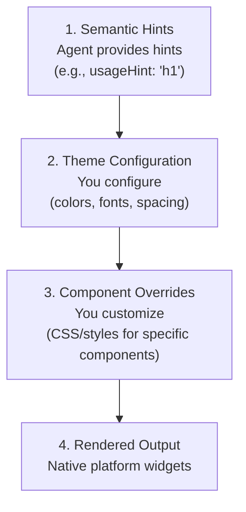

# Theming & Styling

Customize the look and feel of A2UI components to match your brand.

## The A2UI Styling Philosophy

A2UI follows a **client-controlled styling** approach:

- **Agents describe *what* to show** (components and structure)
- **Clients decide *how* it looks** (colors, fonts, spacing)

This ensures:

- ✅ **Brand consistency**: All UIs match your app's design system
- ✅ **Security**: Agents can't inject arbitrary CSS or styling
- ✅ **Accessibility**: You control contrast, focus states, and ARIA attributes
- ✅ **Platform-native feel**: Web apps look like web, mobile looks like mobile

## Styling Layers

A2UI styling works in layers:



## Layer 1: Semantic Hints

Agents provide semantic hints (not visual styles) to guide client rendering:

```json
{
  "id": "title",
  "component": {
    "Text": {
      "text": {"literalString": "Welcome"},
      "usageHint": "h1"
    }
  }
}
```

**Common `usageHint` values:**
- Text: `h1`, `h2`, `h3`, `h4`, `h5`, `body`, `caption`
- Other components have their own hints (see [Component Reference](../reference/components.md))

The client renderer maps these semantic hints to actual visual styles based on your theme and design system.

## Layer 2: Theme Configuration

Each renderer provides a way to configure your design system globally, including:

- **Colors**: Primary, secondary, background, surface, error, success, etc.
- **Typography**: Font families, sizes, weights, line heights
- **Spacing**: Base units and scale (xs, sm, md, lg, xl)
- **Shapes**: Border radius values
- **Elevation**: Shadow styles for depth

TODO: Add platform-specific theming guides:

**Web (Lit):**
- How to configure theme via renderer initialization
- Available theme properties

**Angular:**
- Integration with Angular Material theming
- Standalone A2UI theme configuration

**Flutter:**
- How A2UI uses Flutter's `ThemeData`
- Custom theme properties

**See working examples:**
- [Lit samples](https://github.com/google/a2ui/tree/main/samples/client/lit)
- [Angular samples](https://github.com/google/a2ui/tree/main/samples/client/angular)
- [Flutter GenUI docs](https://docs.flutter.dev/ai/genui)

## Layer 3: Component Overrides

Beyond global theming, you can override styles for specific components:

**Web renderers:**
- CSS custom properties (CSS variables) for fine-grained control
- Standard CSS selectors for component-specific overrides

**Flutter:**
- Widget-specific theme overrides via `ThemeData`

TODO: Add detailed component override examples for each platform.

## Common Styling Features

### Dark Mode

A2UI renderers typically support automatic dark mode based on system preferences:

- Auto-detect system theme (`prefers-color-scheme`)
- Manual light/dark theme selection
- Custom dark theme configuration

TODO: Add dark mode configuration examples.

### Responsive Design

A2UI components are responsive by default. You can further customize responsive behavior:

- Media queries for different screen sizes
- Container queries for component-level responsiveness
- Responsive spacing and typography scales

TODO: Add responsive design examples.

### Custom Fonts

Load and use custom fonts in your A2UI application:

- Web fonts (Google Fonts, etc.)
- Self-hosted fonts
- Platform-specific font loading

TODO: Add custom font examples.

## Best Practices

### 1. Use Semantic Hints, Not Visual Properties

Agents should provide semantic hints (`usageHint`), never visual styles:

```json
// ✅ Good: Semantic hint
{
  "component": {
    "Text": {
      "text": {"literalString": "Welcome"},
      "usageHint": "h1"
    }
  }
}

// ❌ Bad: Visual properties (not supported)
{
  "component": {
    "Text": {
      "text": {"literalString": "Welcome"},
      "fontSize": 24,
      "color": "#FF0000"
    }
  }
}
```

### 2. Maintain Accessibility

- Ensure sufficient color contrast (WCAG AA: 4.5:1 for normal text, 3:1 for large text)
- Test with screen readers
- Support keyboard navigation
- Test in both light and dark modes

### 3. Use Design Tokens

Define reusable design tokens (colors, spacing, etc.) and reference them throughout your styles for consistency.

### 4. Test Across Platforms

- Test your theming on all target platforms (web, mobile, desktop)
- Verify both light and dark modes
- Check different screen sizes and orientations
- Ensure consistent brand experience across platforms

## Next Steps

- **[Custom Components](custom-components.md)**: Build custom components with your styling
- **[Component Reference](../reference/components.md)**: See styling options for all components
- **[Client Setup](client-setup.md)**: Set up the renderer in your app
